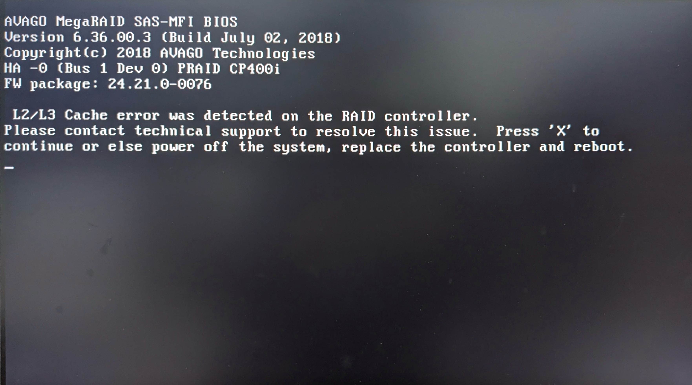

CP400i （ハードウェアRAID） 搭載の PRIMERGY TX1320 M3 に Proxmox VE 8.4 をインストールしようとすると，エラーが出て進まないことがある（執筆中．検証が十分ではないので，断定できない）．

日本語での議論が見当たらなかったので，ここに解決までの詳細を記す．

## 要約

GRUBカーネルパラメータを編集してインストールする．
具体的には，`linux`の行に下記パラメータを追加する．

```
intel_iommu=on iommu=pt
```

## 検証環境

|||
|-|-|
|Model|FUJITSU Server PRIMERGY TX1320 M3|
|CPU|Intel Xeon E3-1230v6|
|BIOS|1.39.0|
|iRMC FW|9.69F|
|SDR|3.18|
|RAID Controller|PRAID CP400i|
|MegaRAID FW|24.21.0-0163|

|||
|-|-|
|仮想化基盤|Proxmox VE 8.4|

## POST中にエラーが出る＆ストレージが見つからない



```
L2/L3 Cache error was detected on the RAID controller.
Please contact technical support to resolve this issue.
Press 'X' to continue or else power off the system, replace the controller and reboot.
```

起動時のPower-On Self-Test (POST) でハマる．ご親切にエラー内容と対処法を教えてくれる．ありがたい．
`X`キーを押下して無視するか，RAIDコントローラを交換して再起動してな～ということらしい．


```
No Hard Disk found!
The installer could not find a supported hard disk.
Please visit www.proxmox.com for more information.
```

また，このエラーを無視してProxmoxのインストールを進めると，長い長い待ち時間の後に`No Hard Disk found!`というエラーが表示される．`Abort`（中止），`Previous`（戻る），`Reboot`（再起動）しか選択肢はなく，これ以上インストールを進めることはできない．

## カーネルパラメータに `intel_iommu=on iommu=pt` を設定する

Proxmox VEのインストールメディアは作成しているものとする．


インストールメディアから起動する．


インストーラ選択画面で`e`キーを押下すると，エントリを編集する画面が表示される．
矢印キーを使用して`linux`で始まる行の末尾にカーソルを移動する．
パラメータ`intel_iommu=on`と`iommu=pt`を追加する．
`Ctrl`+`X`，または`F10`を押下すると，編集後の構成で起動が始まる．


少し待つと，EULAの同意画面が表示される．ここからは，説明に沿ってインストールを進めていけばよい．

また，再起動しても`L2/L3 Cache error was detected ...`エラーが出なくなっている．

## 何が原因だった？

（執筆中）

BIOSでVT-dを無効にする方法でも解決する？らしい（未検証）．

また，ストレージが見つからない問題は，Proxmox VE 7.* では起こらない．なぜ？

## 参考文献

- [[SOLVED] - RAID card issues on Kernel 6.8.4 - boot fail | Proxmox Support Forum](https://forum.proxmox.com/threads/raid-card-issues-on-kernel-6-8-4-boot-fail.148859/)
